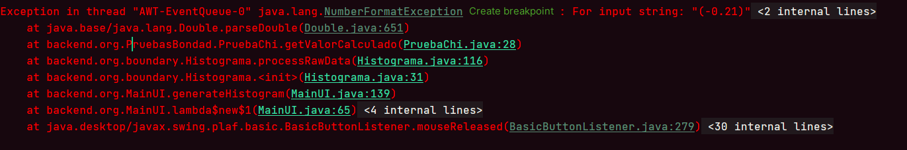
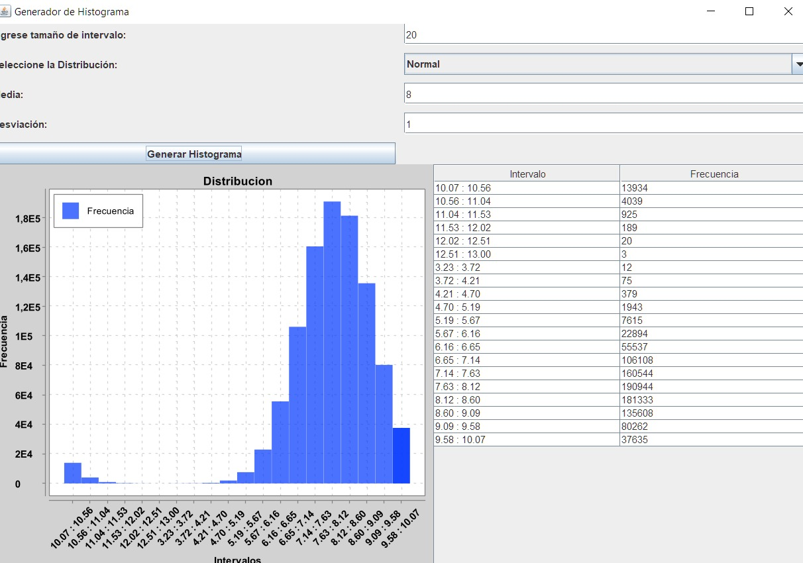

Colo el tp se cae a pedazos.
Cosas que note que hay que arreglar

Hay problemas al usar numeros negativos, intentaste ponerles () pero
con el parentesis Java no sabe parsearlo a Double correctamente.
Tambien tenia problemas a la hora de  hacer el slice buscando por "-" y que no tomase los numeros negativos.
Asi que decidi cambiarlo por ":"

Asi que creo que culpa de eso ahora el diagrama se esta generando mal.
No se si habra una forma sencilla de solucionarlo si no vuelvo atras.
Las pruebas de CHi por otro lado, no funcionan, aveces si dan si usamos 0,05, pero me parece un toque exagerado, y ya no se que hacer
Las tres formulas estan bien a mi parecer.
Deberian aceptar bien... pero no lo hacen.
Tambien estaría bien que extraigas la logica de el tema intervalos a los archivos que estan en la clase "Invervalos", ya que es probable que chi se rompa cuando generamos muchos intervalos,
porque algunos quedan con pocos elementos o poca probabilidad.
Teoria mia: (??Es posible que chi de mal, porque usamos intervalos arbitrarios, y no lo que corresponde, que seria la raiz cuadrada de n??, no sellegados a este punto)